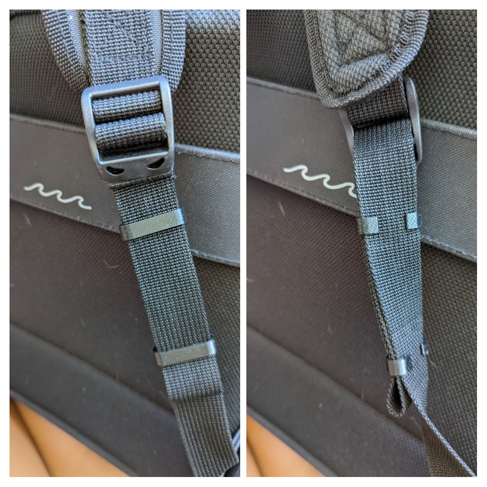

## Backpack Strap Clip

A simple 3d printed clip to hold long backpack straps so they don't flap around.

This model fits about three layers of 1-inch wide straps. It prints in under 10 minutes - I used PETG but PLA would probably work just fine.

**Download**: [3MF](./clip.3MF), [STL](./clip.STL)

_No rights reserved:_ This project is released under the [Creative Commons CC0](https://creativecommons.org/share-your-work/public-domain/cc0/) license.
